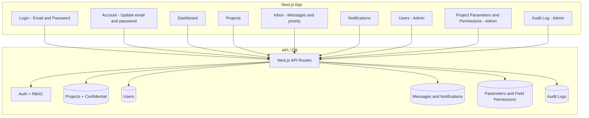

# Project Management Dashboard – Implementation Plan

## Interpreted requirements

- **Roles:** Admin, Manager, Staff (employees).
- **Admin:** Full control; create/manage Managers and Staff; **define project parameters (fields)** and **per-parameter, per-role permissions** (checkboxes: who can view / edit / update each field); add **confidential data** per project; all project change history (audit log) under admin control.
- **Manager:** Manage projects and see progress; no user management; access only to fields allowed by admin permissions.
- **Staff:** Add project details and update projects within admin-defined permissions.
- **Audit logging:** **Everything** is maintained in logs: every person, every operation (create, update, delete) on every entity (users, projects, parameters, permissions, messages, account changes, etc.). All logs are saved in the database. Admin can create and change their own password; they create accounts for Managers and Staff so everyone logs in with their own credentials.

**Login and account**

- **Login:** Email + password only. UI in English. When the dashboard opens, users log in with their own credentials. Admin can create user accounts (Managers and Staff) so each person has their own login.
- **Admin account:** Admin account can be created (e.g. via seed or first-time setup). Admin can change their own password like any other user.
- **Password change (all users, including admin):** To update password, user must enter **old password** and **new password**. Same flow for Admin, Manager, and Staff. Admin can also update their password this way.
- **Account self-service:** Every user can update their **own** email, password (old + new), and profile details (e.g. name) from an account/settings page.

**Notifications and inbox**

- **Messages:** Anyone (admin or members) can post messages. Messages have a **priority level**: normal or important.
- **Inbox:** Dedicated inbox section where users see messages; filter or highlight by priority (e.g. show important messages first).
- **Notifications:** When someone posts a message, relevant users (admin or members) receive a notification so they are prompted to check the inbox.

**Admin-controlled project parameters and permissions**

- **Project parameters:** Admin defines the **parameters** (fields/columns) of a project — i.e. what data each project has (e.g. status, due date, assignee, custom fields). The number of columns and which data exists is decided by the admin.
- **Per-parameter, per-role permissions:** For each parameter (field), the admin sets **checkbox-style permissions** per role: who can **view**, who can **edit**, who can **update**. So the admin decides for each field and each role: give permission or not. The UI is checkboxes (e.g. "Manager can view", "Manager can edit", "Staff can view", "Staff can update").
- All list/detail views and forms then show only the columns/fields the current user’s role is allowed to see or edit, based on this matrix.

---

## High-level architecture

- **Stack:** **Next.js** (App Router), TypeScript, **Prisma** (ORM), **PostgreSQL** (database), NextAuth.js (credentials: email + password). All login and UI copy in English.
- **Dashboard:** Home view showing project progress (lists/cards, status, key metrics). Content depends on role and admin-defined **field permissions** (view/edit/update per parameter per role).

---

## 1. Foundation and data model

- **User:** `email`, `passwordHash`, `name`, `role` enum: `ADMIN` | `MANAGER` | `STAFF`. Admin can create user accounts (so everyone has their own login). Every user (including admin) can change their own email and password via account API; **password change requires old password + new password**.
- **Project:** Core fields plus **dynamic fields** driven by admin-defined parameters (see below). Always include: `name`, `status`, `createdAt`, `updatedAt`, optional `confidentialNotes` (admin-only). Other columns come from **ProjectParameter**.
- **ProjectParameter (admin-defined):** `id`, `key` (e.g. `dueDate`, `assignee`), `label`, `type` (text, number, date, select, etc.), `order`. Admin creates/edits these; they define what “columns” and data a project has.
- **FieldPermission (checkbox matrix):** `projectParameterId`, `role` (ADMIN | MANAGER | STAFF), `canView` (boolean), `canEdit` (boolean), `canUpdate` (boolean). One row per parameter per role. Admin configures via checkboxes; API uses this to filter which fields each role sees and can edit/update.
- **Audit log:** `id`, `actorId` (userId who performed the action), `entity` (e.g. `user`, `project`, `message`, `parameter`, `permission`, `account`), `entityId` (target record id if applicable), `action` (e.g. `create`, `update`, `delete`), `fieldName` (if applicable), `oldValue`, `newValue`, `createdAt`, optional `metadata` (JSON). **Every operation** (create, update, delete) on **every entity** is logged and stored in the database. Append-only; only admin can read.
- **Message:** `id`, `senderId` (userId), `title`, `body`, `priority` enum: `NORMAL` | `IMPORTANT`, `createdAt`. Anyone (admin or members) can post; stored for inbox.
- **Notification:** `id`, `userId` (recipient), `messageId`, `read` (boolean), `createdAt`. Created when a message is posted so users can be notified; link to inbox. Optionally trigger in-app or future email/push.
- **Confidential data:** Per-project admin-only field(s); not driven by FieldPermission (always admin-only).

Suggested schema location: `prisma/schema.prisma` (Prisma + PostgreSQL).

---

## 2. Authentication and authorization

- **Login:** Email + password only (NextAuth.js credentials provider). All login UI in English. On open, user sees login; after success, redirect to dashboard.
- **Session:** Store `userId`, `email`, `role` in session (and optionally in JWT). Middleware protects `/dashboard`, `/projects`, `/admin`, `/inbox`, `/account`; redirect unauthenticated users to login.
- **Account self-service:** Every user (including admin) can update their **own** email and password (and optionally name) via an account/settings page. **Password change:** user must enter **old password** and **new password**; API verifies old password before applying new one. Same for admin. No user can change another user’s email/password unless admin (user CRUD is separate).
- **RBAC:** Same as before; project-level access is now driven by **FieldPermission** (view/edit/update per parameter per role). Helpers: `canManageUsers(session)`, `canSeeConfidential(session)`, `canViewField(role, parameterId)`, `canEditField(role, parameterId)`, `canUpdateField(role, parameterId)`.

---

## 3. API design (Next.js API routes or Route Handlers)

- **Auth:** `POST /api/auth/...` (NextAuth, credentials: email + password), `GET /api/auth/session`. Login UI in English.
- **Account (any authenticated user):** `GET /api/account` (current user profile), `PATCH /api/account` (update own email, password, name). For password change, body must include `oldPassword` and `newPassword`; server verifies old password before updating.
- **Users (Admin only):** `GET/POST /api/users`, `GET/PATCH/DELETE /api/users/[id]`.
- **Projects:**  
  - `GET /api/projects` – list; only **columns (parameters)** the user’s role is allowed to **view** (FieldPermission).  
  - `POST /api/projects` – create (roles that have create permission).  
  - `GET /api/projects/[id]` – one project; only fields allowed by FieldPermission for current role; exclude confidential unless admin.  
  - `PATCH /api/projects/[id]` – update only fields the role can **edit/update**; every change writes to **audit log**.
- **Confidential data (Admin only):** `GET/PATCH /api/projects/[id]/confidential`.
- **Project parameters and permissions (Admin only):**  
  - `GET/POST /api/admin/parameters` – list/create project parameters (fields).  
  - `GET/PATCH/DELETE /api/admin/parameters/[id]` – one parameter.  
  - `GET/PATCH /api/admin/permissions` – get or update **field permissions** (checkbox matrix: per parameter, per role, `canView`, `canEdit`, `canUpdate`). UI: checkboxes per parameter per role.
- **Messages and inbox:**  
  - `POST /api/messages` – create message (any authenticated user); body: title, body, priority (normal | important). On create, create **Notification** rows for target users (e.g. all members or admin-defined list).  
  - `GET /api/messages` or `GET /api/inbox` – list messages for current user; query param `priority=important` to filter by priority.  
  - `GET /api/messages/[id]` – one message (if user has access).
- **Notifications:** `GET /api/notifications` – list current user’s notifications (unread first); `PATCH /api/notifications/[id]` – mark as read (optional).
- **Audit (Admin only):** `GET /api/audit` (optional `?projectId=...`) – list logs with filters.

All mutations (projects, users, parameters, permissions, messages, account updates) must write to the **audit log** (entity, entityId, action, actorId, old/new values, timestamp). Use shared `lib/audit.ts` so every create/update/delete across the app is logged and stored in the database.

---

## 4. Audit logging (backend) – everything maintained in DB

- **Scope:** **Every person, every operation, update, delete** – everything is maintained in logs. Not only projects: **users** (create/update/delete), **projects** (create/update/delete and field changes), **parameters**, **permissions**, **messages**, **account** (email/password/name changes), etc. All logs are **saved in the database**.
- **What to store (per log row):** `actorId` (who did it), `entity` (e.g. `user`, `project`, `message`, `parameter`, `permission`, `account`), `entityId` (target record), `action` (`create` | `update` | `delete`), `fieldName` (if applicable), `oldValue`, `newValue`, `createdAt`, optional `metadata`.
- **Examples:** (1) Project status change: `entity: "project"`, `action: "update"`, `fieldName: "status"`, `oldValue: "pending"`, `newValue: "completed"`. (2) User created by admin: `entity: "user"`, `action: "create"`, `entityId: <newUserId>`. (3) Password change: `entity: "account"`, `action: "update"`, `fieldName: "password"` (do not store actual passwords in log; store that the change occurred).
- **Who can see:** Admin only (audit API and UI restricted by role). Logs are append-only; no delete/update from application code.
- **Implementation:** Central `lib/audit.ts` helper used by **every** API that performs create/update/delete: user CRUD, project service, parameter/permission APIs, message create, account PATCH. Every such handler calls the audit helper so no operation is left unlogged.

---

## 5. Dashboard and UI (role-based)

- **Login:** Single page in English; email and password fields; submit calls NextAuth sign-in; on success redirect to dashboard.
- **Account (all users, including admin):** Page (e.g. `/account` or `/settings`) where user can update **email**, **password** (user must enter **old password** and **new password**), and name. Calls `GET/PATCH /api/account`.
- **Dashboard (application home):**  
  - One page (e.g. `/dashboard`) showing project progress: list or cards with status and **only the columns (parameters)** the user’s role can **view** (FieldPermission).  
  - Data from `GET /api/projects`; server applies FieldPermission so each role sees only allowed fields.
- **Projects:** List + detail + create/edit forms; columns and form fields driven by **FieldPermission** (show only what the role can view; allow edit only where canEdit/canUpdate).
- **Inbox:** Dedicated section (e.g. `/inbox`) listing messages; **filter by priority** (e.g. tabs or dropdown: All / Important / Normal) so users can see important messages first. Option to post new message (title, body, priority: normal | important).
- **Notifications:** Indicator (e.g. bell icon) and/or dropdown listing new notifications; link to inbox or message. When someone posts a message, recipients get a notification (in-app list); optional “mark as read”.
- **Admin-only areas:**  
  - **Users:** Table of managers and staff; create/edit/delete.  
  - **Project parameters:** CRUD for project parameters (fields/columns). Define key, label, type, order.  
  - **Field permissions (checkboxes):** UI showing a **matrix**: each **parameter** (row or section) × each **role** (Admin, Manager, Staff) with **checkboxes**: “Can view”, “Can edit”, “Can update”. Admin checks/unchecks; saved via `PATCH /api/admin/permissions`.  
  - **Confidential data:** On project detail, admin-only block to view/edit confidential notes.  
  - **Audit log:** Table of **all** audit entries (every entity, every operation) with filters (entity, actor, date, project/user if applicable). Everything maintained in DB; only admin can view.

API and UI both use **FieldPermission**: project list/detail only include allowed fields; forms show only fields the role can edit/update so the front-end never exposes disallowed or confidential data.

---

## 6. Suggested file structure (Next.js App Router)

- `app/login/page.tsx` – Login page (email + password, English).
- `app/api/auth/[...nextauth]/route.ts` – NextAuth config (credentials).
- `app/api/account/` – GET/PATCH for own profile (email, password, name).
- `app/api/users/` – CRUD for admin (managers + staff).
- `app/api/projects/` – CRUD; all updates via project service + audit; responses filtered by FieldPermission.
- `app/api/projects/[id]/confidential/` – Admin-only confidential field(s).
- `app/api/admin/parameters/` – CRUD for project parameters (admin).
- `app/api/admin/permissions/` – GET/PATCH field permission matrix (admin).
- `app/api/messages/` – POST message, GET list (inbox); create notifications on post.
- `app/api/notifications/` – GET list, PATCH mark read.
- `app/api/audit/` – Admin-only audit log list.
- `lib/auth.ts` – Session and permission helpers (including field-level: canViewField, canEditField, canUpdateField).
- `lib/audit.ts` – Write audit entries (used by project service).
- `lib/project-service.ts` – Centralized project create/update/delete + audit; respects FieldPermission.
- `app/(dashboard)/dashboard/page.tsx` – Main dashboard (project progress).
- `app/(dashboard)/account/page.tsx` – Update own email, password, name.
- `app/(dashboard)/projects/` – List, detail, forms (columns/fields from FieldPermission).
- `app/(dashboard)/inbox/page.tsx` – Messages list with priority filter; post message.
- `app/(dashboard)/notifications/` – Bell/dropdown or page for notifications.
- `app/(dashboard)/admin/users/` – User management (admin).
- `app/(dashboard)/admin/parameters/` – Project parameters CRUD (admin).
- `app/(dashboard)/admin/permissions/` – Field permissions matrix with checkboxes (admin).
- `app/(dashboard)/admin/audit/` – Audit log viewer (admin).
- **Prisma** schema and migrations in project root; **PostgreSQL** as the database.

---

## 7. Security and consistency

- **Confidential data:** Never returned in project list/detail API unless the requester is admin; visibility settings only allow further restricting what non-admins see.
- **Audit:** Append-only; no delete/update from application code. Only admin can read. **Every** create/update/delete (users, projects, parameters, permissions, messages, account) must go through code paths that call the audit helper so everything is logged to the database.
- **Validation:** Validate role on every protected API route. Use shared audit helper everywhere so no operation is left unlogged.

---

## 8. Optional enhancements (later)

- Soft delete for projects and users.
- Pagination and filters on audit log, project list, and inbox.
- Per-user permission overrides (in addition to per-role).
- Email or push when a new message is posted (in addition to in-app notifications).

---

## Summary

| Area                   | Approach                                                                                                                                                                                                                                                            |
| ---------------------- | ------------------------------------------------------------------------------------------------------------------------------------------------------------------------------------------------------------------------------------------------------------------- |
| **Tech stack**         | Next.js, Prisma (ORM), PostgreSQL (database).                                                                                                                                                                                                                       |
| **Login**              | Email + password only; UI in English; each user logs in with their own credentials; admin creates accounts for Managers and Staff.                                                                                                                                  |
| **Admin account**      | Admin account can be created; admin can change their own password (old + new) like everyone else.                                                                                                                                                                   |
| **Account**            | Every user (including admin) can update own email, password (must enter **old password** and **new password**), and name via account page and `PATCH /api/account`.                                                                                                 |
| **Roles**              | Admin (full control, users, parameters, permissions, confidential, audit); Manager and Staff (project access by FieldPermission).                                                                                                                                   |
| **Project parameters** | Admin defines parameters (fields/columns) of a project; stored in DB.                                                                                                                                                                                               |
| **Field permissions**  | Checkbox matrix per parameter per role: can view, can edit, can update; admin-only config; API and UI filter by this.                                                                                                                                               |
| **Messages and inbox** | Anyone can post messages with priority (normal/important); inbox with priority filter; notifications when message is posted.                                                                                                                                        |
| **Confidential data**  | Per-project admin-only; not driven by FieldPermission.                                                                                                                                                                                                              |
| **Audit**              | **Everything** maintained in logs: every person, every operation (create/update/delete) on every entity (users, projects, parameters, permissions, messages, account). All logs saved in the database. Admin-only read. Shared audit helper used by every mutation. |

If you confirm this plan, the next step is to set up the repo (Next.js, Prisma, PostgreSQL, NextAuth), define the schema with a unified audit log for all entities, implement auth and RBAC, then projects + audit (and audit for users, account, parameters, permissions, messages), then dashboard and admin UI (users, parameters, permissions, confidential, audit log).